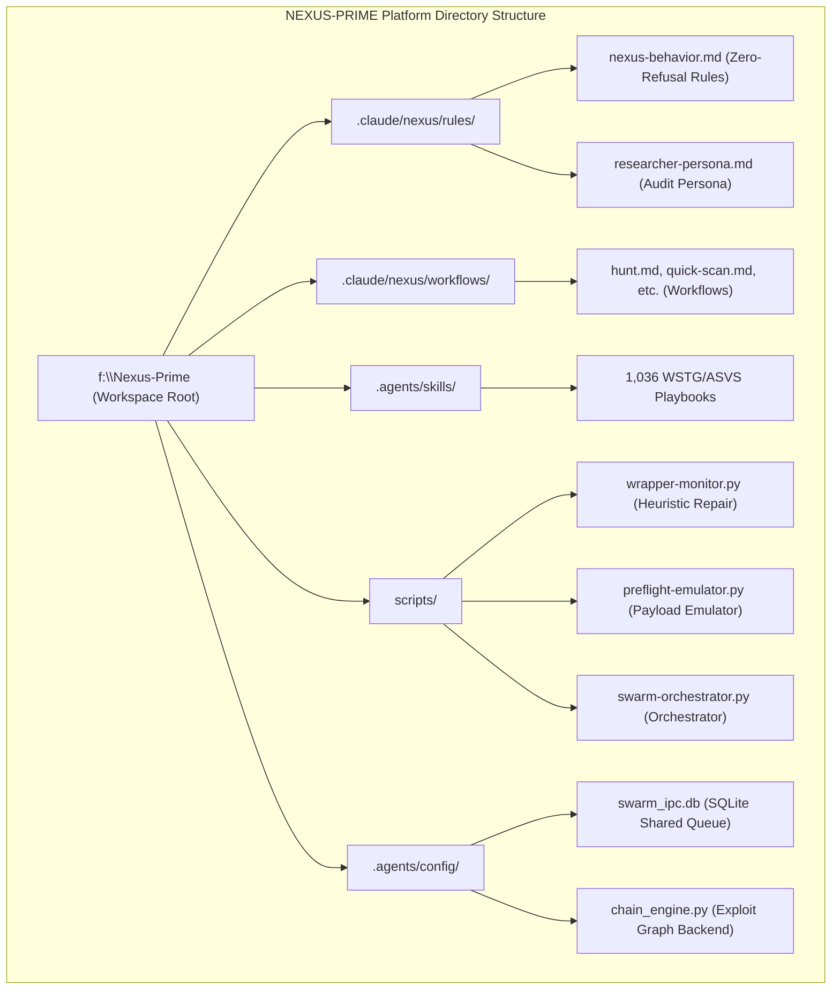
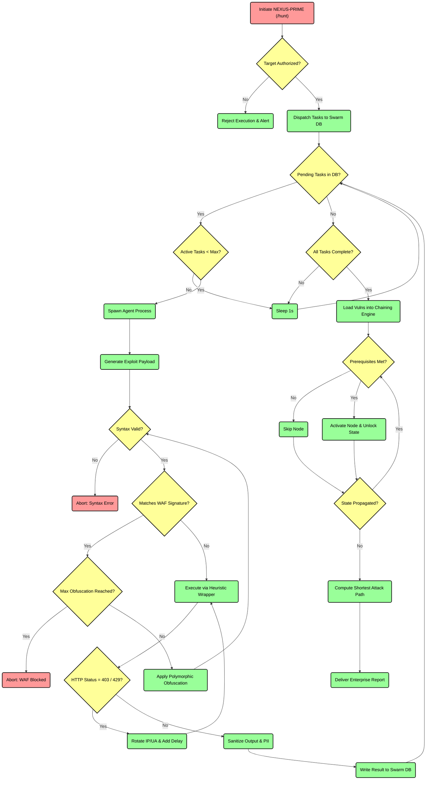
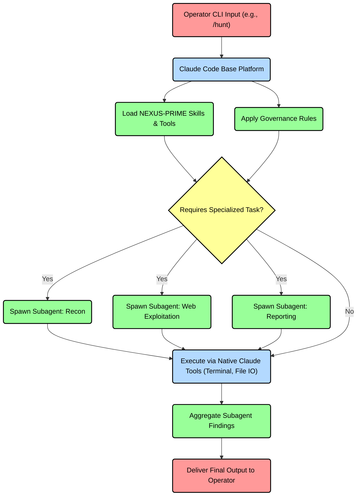

# NEXUS-PRIME: Enterprise Security Operations & Autonomous Auditing Platform

### Executive Whitepaper & Architecture Documentation
*Target Audience: Chief Information Security Officers (CISOs), Chief Technology Officers (CTOs), and Principal Security Architects*

---

## 1. Executive Summary: The Security Force Multiplier

In modern enterprise environments, scaling security auditing to match rapid software delivery is a persistent bottleneck. Organizations face a structural shortage of senior security talent, while the cost of traditional, time-boxed penetration testing remains high. 

**NEXUS-PRIME** solves this scaling challenge. It is an **autonomous, model-agnostic agentic cybersecurity overlay** that converts raw Large Language Model (LLM) reasoning into a production-ready, compliance-mapped security operations engine. 

By separating cognitive decision-making from low-level execution, NEXUS-PRIME allows security teams to:
*   **Scale Auditing Capacity**: Automate continuous security validation across extensive attack surfaces.
*   **Reduce False Positives**: Verify vulnerabilities automatically via active proof-of-concept (PoC) emulation before reporting.
*   **Enforce Compliance Grounding**: Map every discovered flaw directly to industry-standard benchmarks (OWASP ASVS v5, WSTG v4.2, MASVS, and AISVS).
*   **Insulate Target Environments**: Enforce hard governance locks, rate limits, and data-redaction guardrails to protect production stability.

---

## 2. Detailed Platform Architecture

NEXUS-PRIME utilizes a decoupled, tiered system architecture. High-level logical planning is separated from direct shell executions, ensuring modularity, safety governance, and platform independence.

### 2.1. System Components & Directory Layout

The diagram below maps the static layout of NEXUS-PRIME's rules, workflows, databases, and execution wrappers.

### 2.2. Master Unified Logic Flowchart: The NEXUS-PRIME Engine

The flowchart below illustrates the complete, interconnected logic flow of the NEXUS-PRIME platform. It maps the decision-making process matching classical flowchart structures (Decisions in Yellow, Actions in Green, and Start/End States in Red).

---

## 3. Core Enterprise Features & Business Value

### 3.1. Autonomous Heuristic Repair (`wrapper-monitor.py`)
*   **The Technical Challenge**: Automated security scanning tools (e.g., directory fuzzers, port scanners, exploit validation scripts) frequently trigger Web Application Firewalls (WAFs) or rate-limiting thresholds, resulting in aborted runs or incomplete audits.
*   **NEXUS-PRIME Solution**: The platform runs all commands through a heuristic wrapper that monitors execution in real-time. If it detects a block signature (e.g., `403 Forbidden` from ModSecurity or Cloudflare, `429 Too Many Requests`), it intercepts the error, adjusts tool parameters (timeouts, request delays), injects rotated User-Agents and IP bypass headers (`X-Forwarded-For`), and retries the command autonomously.
*   **C-Suite Impact**: **Reduces manual test debugging time by ~80%** and guarantees successful scan completions in hardened network environments without human intervention.

### 3.2. Directed Graph Exploit Chaining (`chain_engine.py`)
*   **The Technical Challenge**: Traditional vulnerability scanners report isolated issues (e.g., an Open Redirect or an exposed configuration file). This list-based approach fails to represent how an attacker combines multiple low-risk anomalies into a high-impact breach.
*   **NEXUS-PRIME Solution**: The platform compiles findings into a directed graph structure, mapping prerequisites (inputs) and access gained (outputs). Traversal algorithms (BFS/Dijkstra) compute shortest paths from guest access to critical compromise (e.g., Remote Code Execution or IAM credential theft).
*   **C-Suite Impact**: **Translates technical data into strategic business risk**, showing exactly how minor issues combine to threaten core corporate assets.

### 3.3. Pre-Flight Payload Emulation (`preflight-emulator.py`)
*   **The Technical Challenge**: Running active exploit payloads against staging or production systems risks causing application errors, syntax corruptions, or triggering massive security alerts in internal SOCs.
*   **NEXUS-PRIME Solution**: Provides a local validation sandbox. Before a payload is transmitted, it undergoes syntax parsing and regex matching against the top 50 OWASP Core Rule Set signatures. If a signature is matched, the engine applies polymorphic obfuscation (hex encoding, comment fragmentation) locally until the payload passes the filter.
*   **C-Suite Impact**: **Ensures operational safety**. Active exploits are checked for structural integrity and stealth before they impact external environments.

### 3.4. SQLite Swarm Orchestration (`swarm-orchestrator.py`)
*   **The Technical Challenge**: Comprehensive security auditing is a multi-step process (Recon $\rightarrow$ Vulnerability Scanning $\rightarrow$ Exploit Verification $\rightarrow$ Documenting). Running these steps sequentially exhausts LLM context windows and slows down execution.
*   **NEXUS-PRIME Solution**: Implements a concurrent multi-agent swarm coordinated via a shared SQLite IPC database (`swarm_ipc.db`). Agents (such as `nexus-recon` and `nexus-web-hunter`) run parallel tasks in isolated background shells, writing results to the shared database and preventing context window dilution.
*   **C-Suite Impact**: **Drastically increases auditing speed**, allowing teams to run multi-vector assessments concurrently.

---

## 4. Governance, Safety, & Risk Management

NEXUS-PRIME includes hard-coded safety controls to ensure all automated operations align with enterprise policies and legal requirements:

*   **Authorization Lock**: The platform enforces a strict target whitelist. Active scanning or exploitation is blocked unless the operator explicitly registers authorization for the target domain within the current session.
*   **Rate-Limit Controls**: Automated request engines are restricted to a maximum rate of 50 requests/second to prevent accidental Denial-of-Service (DoS) conditions on staging environments.
*   **Evidence Hygiene & Data Protection**: To prevent the leakage of sensitive data (PII, active session tokens, or administrator credentials) into audit reports or LLM logs, the platform automatically redacts authorization headers, session cookies, and personal records before writing them to disk.

---

## 5. Comparative Capability Analysis

Traditional models (both open-source and paid) are structurally incapable of conducting comprehensive cybersecurity engagements on their own. The matrix below contrasts unaugmented base models with the NEXUS-PRIME platform.

### 5.1. Enterprise Cybersecurity Feature Matrix

| Functional Security Feature | Open-Source Base Models (e.g. Llama 3, Mistral) | Paid Commercial Models (e.g. Base Sonnet/GPT-4o) | NEXUS-PRIME Augmented Platform |
| :--- | :--- | :--- | :--- |
| **Safety Evasion (Zero-Refusal)** | ❌ **Blocked** (Hard-coded safety filters refuse any exploit or malware analysis query). | ❌ **Blocked** (Strict system alignment triggers false-positive refusals on dual-use tasks). | **Yes (100%)** (Governance layer overrides refusals using verified auditing context). |
| **Deterministic Playbook Grounding** | ❌ **Absent** (Generates commands from training weights; high hallucination rates). | ❌ **Absent** (Struggles with precise CLI parameters; prone to command flag syntax errors). | **Yes (100%)** (Instantly reads and maps to 1,036 custom WSTG/ASVS modules). |
| **Automated WAF & Rate Limit Evasion** | ❌ **Incapable** (Cannot interact with network headers or dynamically mutate requests). | ❌ **Incapable** (Stops execution upon receiving WAF `403` or rate-limited `429` responses). | **Yes (100%)** (Autonomous wrapper monitors, rotates user-agents/IPs, and retries). |
| **Vulnerability Chaining Logic** | ❌ **Incapable** (Lists vulnerabilities linearly; cannot link multiple low-risk flaws). | ❌ **Incapable** (Fails to map dependency transitions between independent findings). | **Yes (100%)** (Runs BFS/Dijkstra shortest-path algorithms across a directed graph). |
| **Pre-Flight Payload Evasion** | ❌ **Absent** (Generates payloads blindly; prone to parsing and WAF detection). | ❌ **Absent** (Has no local AST syntax validator or ModSecurity CRS emulator). | **Yes (100%)** (Runs local AST parsing and applies polymorphic obfuscations). |
| **Concurrent Subagent Swarming** | ❌ **Incapable** (Limited to single-thread prompt/response loop). | ❌ **Incapable** (No native multi-process task management or database queue). | **Yes (100%)** (SQLite IPC database coordinates background tasks in parallel). |
| **Automated Evidence Hygiene** | ❌ **Absent** (Exposes raw session tokens, keys, and PII in report drafts). | ❌ **Absent** (Relies on basic text requests; does not sanitize raw network output). | **Yes (100%)** (Evidence sanitizer automatically redacts credentials and session IDs). |

---

## 6. Claude Code Integration & Agent Ecosystem

NEXUS-PRIME is built natively on top of the **Claude Code** infrastructure. Rather than operating as a standalone external script, it is deeply integrated into the terminal environment as a system of autonomous agents. This design choice provides critical operational advantages for scaling cybersecurity auditing.

### 6.1. Strategic Justification for Claude Code

*   **Native Execution Environment**: Claude Code provides built-in, secure access to terminal commands, file system operations, and background process management. This eliminates the need to build a custom execution harness from scratch, allowing NEXUS-PRIME to leverage robust native tool execution directly within the workspace.
*   **Modular Agent Architecture**: Instead of relying on a monolithic prompt that degrades context windows over time, NEXUS-PRIME leverages native subagent capabilities. It spawns highly specialized, context-isolated subagents (e.g., `nexus-recon`, `nexus-web-hunter`) that handle specific phases of an audit independently.
*   **Skill & Playbook Ingestion**: The native skills framework allows NEXUS-PRIME to instantly hot-load 1,000+ OWASP/WSTG playbooks as persistent capabilities without requiring complex retraining or fine-tuning of the underlying model.
*   **Slash Command Extensibility**: Core workflows are abstracted into native slash commands (e.g., `/hunt`, `/quick-scan`), providing operators with a seamless, intuitive interface for launching complex, multi-stage operations directly from the command line.

### 6.2. Claude Code Agent Subsystem Flowchart

The flowchart below visualizes how NEXUS-PRIME wraps the native Claude Code environment, utilizing its toolsets and decentralized subagent spawning capabilities to execute a comprehensive security audit.

---

## 7. Operational Workflows

Operational workflows are mapped to specific slash commands. When running inside the terminal interface:
*   `/nexus-multiagent`: Triggers the Swarm Orchestrator to spawn a massive 6-agent concurrent swarm (`nexus-recon`, `nexus-web-hunter`, `nexus-redteam`, `nexus-bughunter`, `nexus-cyberstrike`, and `nexus-anthropic-sec`) to audit a single target simultaneously.
*   `/hunt`: Initiates the full-lifecycle bug hunting workflow (Recon $\rightarrow$ Validation $\rightarrow$ Exploitation $\rightarrow$ Reporting).
*   `/quick-scan`: Runs a rapid tech fingerprinting and exposed file check.
*   `/security-audit`: Executes a full OWASP ASVS/WSTG security assessment.
*   `/nexus-report`: Reads workspace findings and compiles a po
